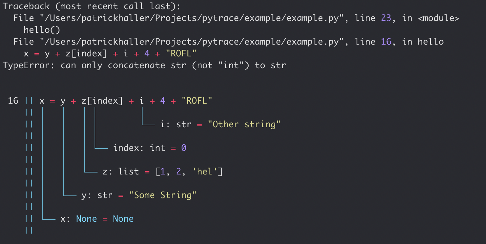

# frosch - Runtime Error Debugger

[](https://badge.fury.io/py/frosch)


Better runtime error messages 

Are you also constantly seeing the runtime error message the 
python interpreter is giving you?
It lacks some color and more debug information!


Get some good looking error tracebacks and beautifuly formatted
last line with all its last values *before* you crashed the program.

<h1 align="center">
  
</h1>


## Installation

```bash
$ pip install frosch

```

## Usage 

```python

from frosch import init

init()

x = 3 + "String"

```