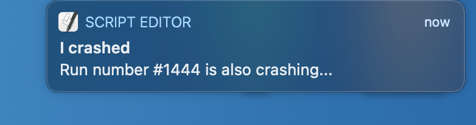

# frosch - Runtime Error Debugger

[](https://badge.fury.io/py/frosch)


Better runtime error messages 

Are you also constantly seeing the runtime error message the 
python interpreter is giving you?
It lacks some color and more debug information!


Get some good looking error tracebacks and beautifuly formatted
last line with all its last values *before* you crashed the program.

<h1 align="center" style="padding-left: 20px; padding-right: 20px">
  
</h1>


## Installation

```bash
$ pip install frosch
```

## Usage 


Call the hook function at the beginning of your program.

```python

from frosch import hook

hook()

x = 3 + "String"

```

## Contribution

`frosch` uses [poetry](https://github.com/python-poetry/poetry) for build and dependency
management, so please install beforehand.

### Setup

```bash
$ git clone https://github.com/HallerPatrick/frosch.git
$ poetry install
```

### Run tests

```python
$ python -m pytest tests
```
2 months ago

# Configuration

## Themes

frosch allows to use different themes for styling the output:

| Themes   |          |          |               |             |      |
|----------|----------|----------|---------------|-------------|------|
| abap     | bw       | igor     | native        | rrt         | trac |
| algol    | colorful | inkpot   | paraiso_dark  | sas         | vim  |
| algol_nu | default  | lovelace | paraiso_light | solarized   | vs   |
| arduino  | emacs    | manni    | pastie        | stata_dark  | xcod |
| autumn   | friendly | monokai  | perldoc       | stata_light |      |
| borland  | fruity   | murphy   | rainbow_dash  | tango       |      |

Usage:

```python
from frosch import hook

hook(theme="vim")
````

# OS Notifications

But wait there is more!

Running longer scripts in the background?

Just add a title and/or message to the hook and it will you give a notification when your program is crashing.

```python

from frosch import hook

hook(
  theme="vs", # VSCode Theme
  title="I crashed!",
  message="Run Number #1444 is also crashing..."
)
```


<h2 align="center" style="padding-left: 40px; padding-right: 40px">
  <p>Mac Notification</p>
  
  <p>Linux Notification</p>
  
  <p>Windows Notification</p>
  
</h2>